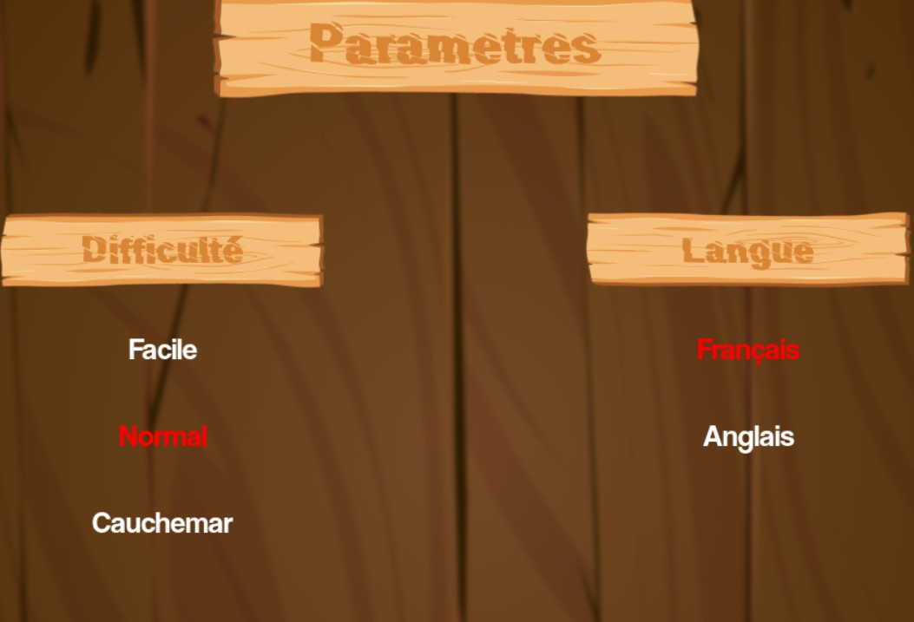
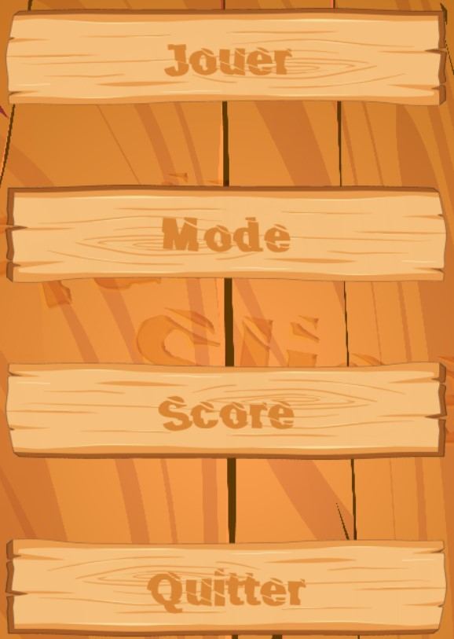

# typing-game



This project is an implementation of the classic **Fruit Ninja** game using the **Pygame** library.

🎮 Features

- Slice fruits by pressing the corresponding key on your keyboard.
- Randomly generated fruits with different letters.
- Physics-based movement for realistic fruit falling.
- Visual slicing effect when a fruit is cut.
- Sound effects for a more immersive experience.

## Requirements

To run this project, you need to have **Python** and **Pygame** installed on your machine.

### Install Pygame

You can install Pygame via `pip` if it's not already installed:

```bash
pip install pygame
```

---

# Project Structure

The project is organised as follows:  
Typing-Game/

- assets/
  - backgrounds/
  - bonus_malus/
  - fonts/
  - plank/
  - props/
  - sounds/
- class_folder/
  - Button_simple/
  - Button/
  - Fruits_slice/
  - Fruits/
  - Screen/
  - Sounds/
  - translation_manager/
- display/
  - \_init/
  - diplay_menu_assets/
- \_settings
- main
- new_test
- translation.json

### features

  
the game offers serveral features:

assets/

- **backgrounds/**: Contains all background images used in the game.
- **bonus_malus/**: Contains images for bonus or malus items freeze or bombe power-ups.
- **fonts/**: Font files used for displaying game text.
- **plank/**:Images for any game UI components, such as the fruit slicing board.
- **props/**: contains images for the props that interact with the player(bombs, ice cubes, etc..)

class folder/

- **Button_simple/** : Contains all background images used in the game.
- **Button/**: Contains more advanced button functionality for interactive menus.
- **Fruits_slice/**: Handles the visual effects when a fruit is sliced.
- **Fruits/**: Contains logic for fruit generation, movement, and interactions.
- **Screen/**: Handles the screen management, drawing backgrounds, and updates.
- **Sounds/**: Controls sound effects in the game (such as fruit slicing, bombs, etc.).
- **translation_manager/**: Manages translations for different languages using a JSON file.

display/

- **init/**: Initialization for the display.
- **display_menu_assets/**: Contains assets and logic for game menus, such as the main menu and in-game UI.

game/

- **menues/**: Contains menu logic, including game start, pause, and game over menus.
- **scores/**: Manages player attributes, scores, and the high score database (scores.json).

setting/

Game settings file for constants like FPS, screen resolution, fruit list, etc.

main/:

The main script that runs the game.

new_test/

Folder for testing purposes (likely for debugging or feature testing).

translation.json:

JSON file for managing different languages in the game.

---

## How to play

1.  _Start the Game_: Run `new_test.py` to launch the game.

2.  _Fruit Slicing_: When the fruits start falling, press the key corresponding to the letter on the fruit to slice it.

3.  _Avoid Bombs_: Be carful to avoid bomb, or they will cost you a life.

4.  _Use Power-Ups_: Some fruits will grant power-ups like ice cubes that freeze the screen, allowing you to slice all fruits present during the freeze duration.

5.  _Game Over Sound_: Plays when the game ends.

## Translations

The game supports multiple languages! Translations are stored in the `translation.json` file, which you can update with your own language support.

To change the language, simply update the settings in the _TranslationManager_.

---

# Contributing

This project was made by:

- [Vanessa Sabatier](https://github.com/vanessa13001)
- [Jolyne Mangeot](https://github.com/jolyne-mangeot)
- [Adeline Patenne](https://github.com/AdelinePat/)
- [Florence Navet](https://github.com/florence-navet)

### Licence

This project is licensed under the MIT License.
